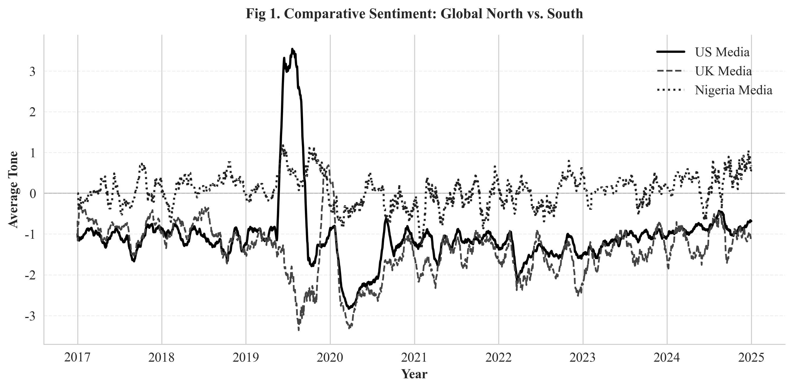
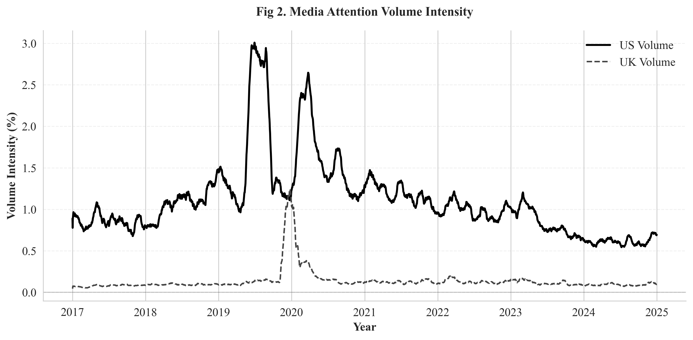
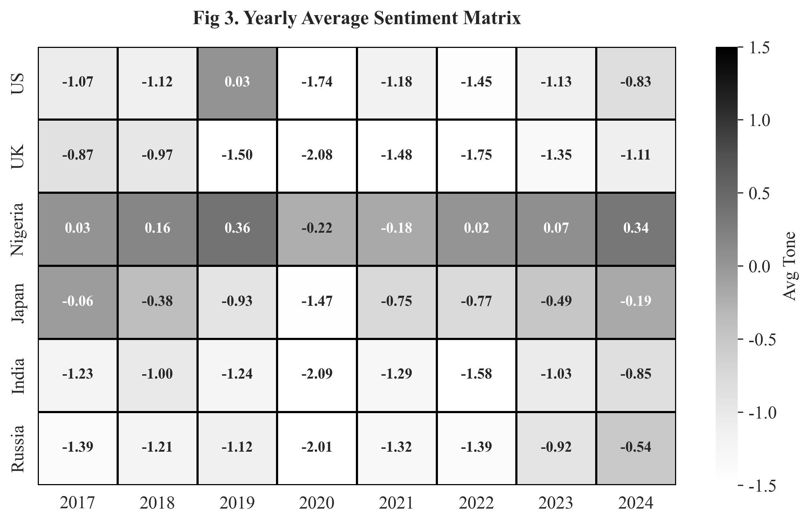
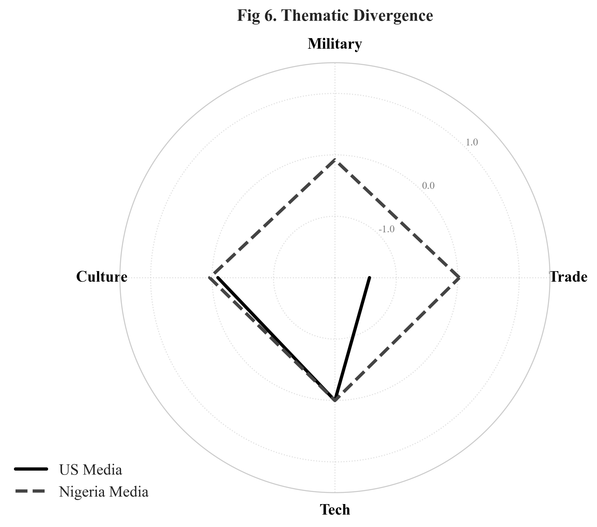

# Language as Power: A Quantitative Analysis of Global Narratives on China (2017-2024)
# 语言即权力：基于 GDELT 的全球对华舆情量化分析


## 📖 Project Overview (项目简介)

This project is a computational social science study conducted as a final assignment for the "Language and Power" course. It utilizes the **GDELT 2.0 API** to analyze over 7 years of global news metadata (2017-2024), aiming to reveal the **"Discourse Divide"** between the Global North (e.g., US, UK) and the Global South (e.g., Nigeria) regarding China's international image.

本项目是“语言即权力”课程的结课研究作业。通过 Python 编程调用 GDELT 2.0 API，对 2017-2024 年间的全球新闻数据进行挖掘，量化呈现了西方发达国家与全球南方国家在构建“中国形象”时存在的显著话语鸿沟。

**Key Findings:**
*   **Bifurcated Image:** The US media constructs a structurally negative narrative (Mean Tone: -1.06), while Nigerian media presents a pragmatic and positive outlook (+0.07).
*   **Agenda Setting:** The US dominates global attention volume on China-related issues (1.11%), exhibiting a strong "Othering Gaze" compared to the UK (0.14%).
*   **Thematic Divergence:** Western narratives focus on "Military/Threat" frames, while African narratives focus on "Trade/Development" frames.

## 📂 Project Structure (项目结构)

```text
├── main.py                  # Entry point (Main Execution Script)
├── requirements.txt         # Dependencies
├── src/                     # Source Code
│   ├── __init__.py
│   ├── config.py            # Global Settings (IEEE Style configurations)
│   ├── data_loader.py       # Data Fetching & Cleaning (GDELT API)
│   ├── analysis.py          # Statistical Calculations & Table Generation
│   └── visualization.py     # Plotting Logic (Matplotlib/Seaborn)
├── data/
│   └── raw/                 # Raw CSV data fetched from GDELT (Auto-generated)
└── figures/                 # Generated Plots (IEEE Black & White Style)
```

## 📊 Visualizations (核心图表)

The project automatically generates **IEEE-compliant black-and-white figures** optimized for academic publication.

### 1. The Discourse Divide (舆论分裂)
*Comparative Sentiment Analysis of US, UK, and Nigeria Media (2017-2024).*


### 2. Agenda Setting Power (议程设置权力)
*Comparison of Media Attention Volume between US and UK.*


### 3. Global Geopolitical Heatmap (全球地缘热力矩阵)
*Yearly average sentiment scores across key nations (Annotated Grid).*


### 4. Thematic Narration (叙事框架雷达图)
*Divergence in thematic framing (Trade, Military, Culture, Tech) between US and Nigeria.*


*(Note: Boxplots [Fig 4] and Regression Analysis [Fig 5] are also generated in the `figures/` folder.)*

## 🚀 How to Run (如何运行)

1.  **Clone the repository:**
    ```bash
    git clone https://github.com/VALONSIDE/Language-Power-GDELT.git
    cd Language-Power-GDELT
    ```

2.  **Install dependencies:**
    ```bash
    pip install -r requirements.txt
    ```

3.  **Run the analysis:**
    ```bash
    python main.py
    ```
    *The script will automatically fetch data from GDELT API, calculate statistics, print data tables to the console, and generate all figures in the `figures/` directory.*

## 🛠️ Tech Stack (技术栈)

*   **Language:** Python 3.10+
*   **Data Acquisition:** `requests` (Interacting with GDELT DOC 2.0 API)
*   **Data Processing:** `pandas`, `numpy` (Time-series resampling, Rolling mean)
*   **Visualization:** `matplotlib`, `seaborn` (Customized for IEEE Academic Style, Monochrome optimization)

## 📜 Methodology (方法论)

*   **Data Source:** [The GDELT Project](https://www.gdeltproject.org/) (Global Database of Events, Language, and Tone).
*   **Metrics:**
    *   `AvgTone`: Sentiment score ranging generally from -10 (Negative) to +10 (Positive).
    *   `Volume Intensity`: The percentage of all news coverage monitored by GDELT that matches the query.
*   **Analysis:** 30-day rolling average applied to smooth daily noise; Descriptive statistics for cross-national comparison.

---

*This project is for academic research purposes only.*
